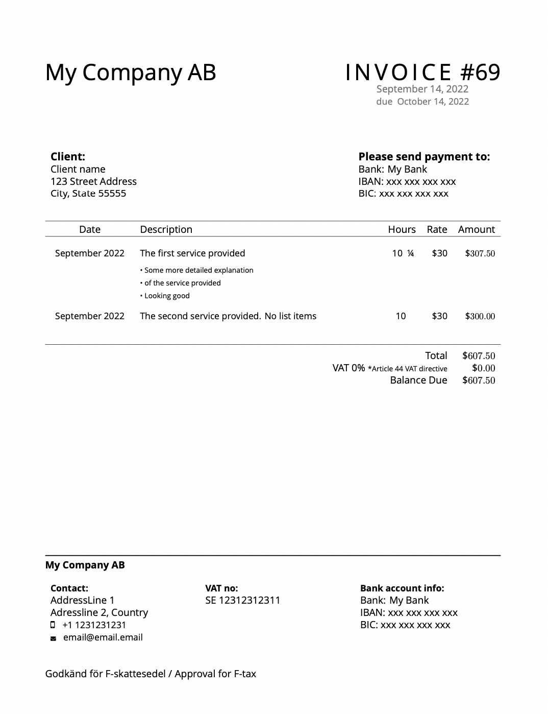

# invoice-template
invoice template

## Dependencies
* LaTeX
* [Pandoc](http://pandoc.org/), the universal document converter.

## Run
Run `make example`, this will output `example.pdf` using the `exampleDetails.yaml` as input.

The default `make` target expects a `details.yaml` file and will output `invoice.pdf`

## Based on these projects
<https://github.com/mkropat/dapper-invoice>

<https://github.com/mrzool/invoice-boilerplate>

## Example

